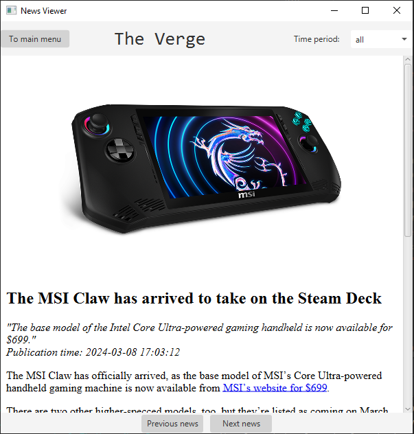

# Simple news resource parser

JavaFX application for parsing "The Verge" and displaying it in a simple way.



## Features

- Timeperiod filter
- Switching between news
- Parsed news stored in Database (MySQL)


## Run Locally

Clone the project

```bash
  git clone https://link-to-project
```

Go to the project

```bash
  mvn package -DskipTests
```

Run application

```bash
  java -jar *application_name*.jar
```